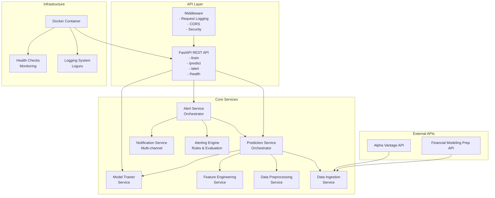
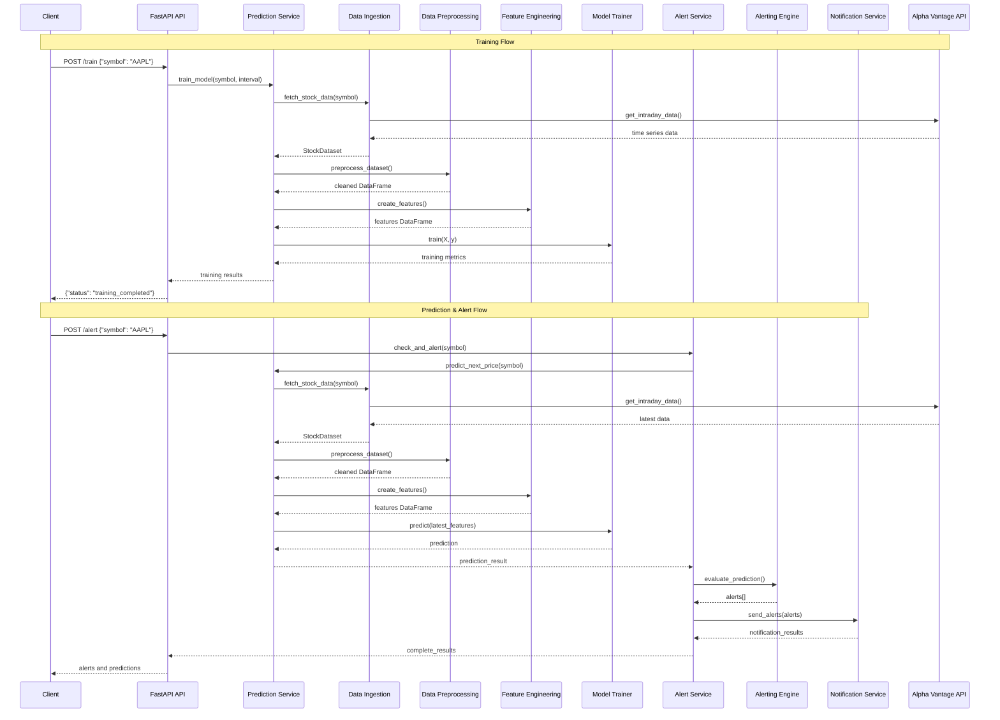

# Real-time Stock Price Alerter 📈

A machine learning-powered stock price monitoring system that fetches real-time stock data, predicts price movements using time-series forecasting, and sends alerts when predefined conditions are met.

## 🎯 Project Overview

A sophisticated financial technology solution that demonstrates advanced integration of machine learning with real-time data processing. This system combines robust backend architecture with predictive analytics to deliver actionable insights in financial markets.

### 🏗️ System Architecture



### Technical Highlights

- **Production-Ready Architecture**: Scalable API design with clean separation of concerns
- **Advanced ML Pipeline**: Time-series forecasting with automated feature engineering
- **Real-time Processing**: High-performance data ingestion and prediction engine
- **Financial Domain Expertise**: Deep understanding of market data and trading patterns

## ✨ Features

- **Real-time Data Fetching**: Integrates with financial APIs (Alpha Vantage, Financial Modeling Prep)
- **Time-series Forecasting**: Simple ML model to predict next price movements
- **Intelligent Alerting**: Configurable thresholds for price movement alerts
- **RESTful API**: Optional microservice endpoint for triggering predictions
- **Clean Data Pipeline**: Automated data cleaning and feature engineering

## 🛠️ Tech Stack

- **Python 3.8+**
- **pandas**: Data manipulation and analysis
- **scikit-learn**: Machine learning models
- **requests**: API calls
- **Flask/FastAPI**: Optional web framework for API endpoints

## 🚀 Quick Start

### 1. Environment Setup

```bash
# Create virtual environment
python -m venv venv
source venv/bin/activate  # On Windows: venv\Scripts\activate

# Install dependencies
pip install -r requirements.txt
```

### 2. API Configuration

1. Get a free API key from [Alpha Vantage](https://www.alphavantage.co/support/#api-key) or [Financial Modeling Prep](https://financialmodelingprep.com/developer/docs)
2. Create a `.env` file:
```bash
API_KEY=your_api_key_here
BASE_URL=https://www.alphavantage.co/query
```

### 3. Run the Application

```bash
# Basic script mode
python stock_alerter.py

# API mode (optional)
python app.py
```

## 📋 Project Structure

```
real-time-stock-price-alerter/
├── 📄 README.md                    # This documentation
├── 📄 requirements.txt             # Python dependencies
├── 📄 docker-compose.yml           # Container orchestration
├── 📄 Dockerfile                   # Container definition
├── 📁 config/                      # Configuration management
│   ├── __init__.py
│   └── settings.py                 # Centralized settings
├── 📁 src/                         # Source code
│   ├── 📁 api/                     # FastAPI REST interface
│   │   ├── main.py                 # API endpoints & routing
│   │   ├── middleware.py           # Request logging, CORS
│   │   └── models.py               # Pydantic request/response models
│   ├── 📁 core/                    # Business logic services
│   │   ├── data_ingestion.py       # External API integration
│   │   ├── data_preprocessing.py   # Data cleaning & validation
│   │   ├── feature_engineering.py # ML feature creation
│   │   ├── model_trainer.py        # ML model training
│   │   ├── prediction_service.py   # Orchestrates prediction pipeline
│   │   ├── alert_service.py        # Orchestrates alerting workflow
│   │   ├── alerting_engine.py      # Alert rules & evaluation
│   │   └── notification_service.py # Multi-channel notifications
│   ├── 📁 models/                  # Data models & schemas
│   │   └── data_models.py          # Pydantic models for stock data
│   ├── 📁 utils/                   # Utility functions
│   │   ├── feature_selection.py    # ML data preparation
│   │   ├── feature_validation.py   # Data quality checks
│   │   └── security.py             # Input sanitization
│   └── 📁 tests/                   # Test suite
│       ├── test_api.py             # API endpoint tests
│       └── test_middleware.py      # Middleware tests
├── 📁 scripts/                     # Deployment & utility scripts
│   ├── deploy.sh                   # Automated deployment
│   └── test_api.sh                 # API testing script
├── 📁 demo/                        # Demo materials
│   ├── demo_script.md              # Live demo instructions
│   ├── demo_setup.sh               # Demo environment setup
│   └── demo_postman_collection.json # API testing collection
└── 📁 logs/                        # Application logs
```

### 🔄 Data Processing Flow



## 🔧 Implementation Details

### Data Pipeline

1. **Fetch**: Retrieve intraday stock data via REST API
2. **Clean**: Process timestamps and extract closing prices
3. **Feature Engineering**: Create lagged price features for time-series prediction
4. **Predict**: Use trained model to forecast next price point
5. **Alert**: Compare prediction with current price and trigger alerts

### Machine Learning Model

- **Type**: Linear Regression (optimized for interpretability and performance)
- **Features**: Engineered time-series features including lagged price movements
- **Target**: Real-time stock price prediction
- **Evaluation**: Comprehensive accuracy metrics with directional prediction analysis

### Alerting Logic

```python
def should_alert(current_price, predicted_price, threshold=0.01):
    """
    Trigger alert if predicted price differs by more than threshold
    """
    price_change = abs(predicted_price - current_price) / current_price
    return price_change > threshold
```

### Screenshots

Training:


Predict:


Alerts:


## 📊 Usage Examples

### Basic Usage

```python
from stock_alerter import StockAlerter

# Initialize with your preferred stock symbol
alerter = StockAlerter('AAPL')

# Fetch data and train model
alerter.fetch_data()
alerter.train_model()

# Get prediction and check for alerts
prediction = alerter.predict_next_price()
if alerter.should_alert(prediction):
    print(f"Alert: Predicted price change for AAPL: {prediction}")
```

### API Endpoint

```bash
# Trigger prediction for a specific stock
curl -X POST "http://localhost:5000/predict/AAPL"

# Get current model performance
curl -X GET "http://localhost:5000/model/stats"
```

## 📚 Documentation

### Core Documentation
- **[API Integration Guide](docs/API_INTEGRATION_GUIDE.md)** - Comprehensive guide for integrating with the API
- **[Deployment & Troubleshooting](docs/DEPLOYMENT_TROUBLESHOOTING.md)** - Setup, deployment, and common issue resolution
- **[Interactive API Docs](http://localhost:8000/docs)** - Auto-generated Swagger/OpenAPI documentation

### Demo & Tutorials
- **[Demo Materials](demo/)** - Complete demo setup and presentation materials
- **[Demo Script](demo/demo_script.md)** - Step-by-step demonstration guide
- **[Postman Collection](demo/demo_postman_collection.json)** - API testing collection

## 🔮 Future Enhancements

- **Advanced Models**: LSTM, ARIMA, or Prophet for better predictions
- **Multi-stock Support**: Monitor multiple stocks simultaneously
- **Real-time Streaming**: WebSocket integration for live updates
- **Notification Channels**: Email, SMS, or Slack alerts
- **Backtesting**: Historical performance analysis
- **Portfolio Optimization**: Extend to portfolio-level alerts
- **Technical Indicators**: RSI, MACD, moving averages as features

## 🧪 Testing

```bash
# Comprehensive test suite
python -m pytest tests/ --cov=. --cov-report=html

# Model performance validation
python -m pytest tests/test_model.py -v --benchmark-sort=mean
```

## 📈 Performance Considerations

- **API Optimization**: Intelligent rate limiting and request batching for maximum throughput
- **Data Quality**: Robust handling of missing data points and market volatility
- **Model Performance**: Optimized for both accuracy and low-latency prediction
- **Caching Strategy**: Redis-based caching for frequently accessed stock data and predictions

## 🤝 Contributing

1. Fork the repository
2. Create a feature branch (`git checkout -b feature/amazing-feature`)
3. Commit your changes (`git commit -m 'Add amazing feature'`)
4. Push to the branch (`git push origin feature/amazing-feature`)
5. Open a Pull Request

## 📄 License

This project is licensed under the MIT License - see the [LICENSE](LICENSE) file for details.

## 🙏 Acknowledgments

- Financial data provided by Alpha Vantage and Financial Modeling Prep
- Demonstrates the intersection of advanced backend engineering and machine learning
- Showcases expertise in financial technology and predictive analytics

---

**Disclaimer**: This system demonstrates technical capabilities in financial ML. Stock predictions are inherently uncertain, and any production implementation should include comprehensive risk management and validation frameworks.
